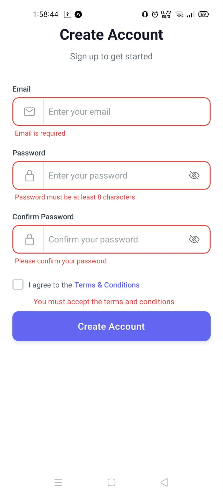

# react-native-custom-form

A highly customizable, feature-rich, and distinct authentication form for React Native. Built with flexibility in mind, it supports multiple validation strategies (Formik + Yup, React Hook Form + Zod/Yup), biometric authentication, social logins, and extensive styling capabilities.


## 🚀 Features

- **Multiple Auth Modes:** Seamlessly switch between Sign In and Sign Up.
- **Flexible Validation:** First-class support for **Formik** and **React Hook Form**, with **Yup** or **Zod** schemas.
- **Biometric Integration:** Built-in UI for Fingerprint/FaceID authentication.
- **Social Logins:** Easy-to-configure social login buttons (Google, Facebook, Apple, etc.).
- **Colocated Styling:** Style every component (inputs, buttons, texts) directly from the configuration props.
- **Icon System:** Unified `iconSource` prop supporting any icon library (e.g., `@expo/vector-icons`, `react-native-vector-icons`).
- **Smart Inputs:** 
  - Inbuilt Password visibility toggle.
  - Inbuilt Phone number input with country code picker support.
  - Auto-formatting and specific keyboard types.
- **Hidden-by-Default:** clean API where you enable only what you need.

## � Core Concepts

To get the form running, you only need three required props:
- `mode`: `'signin'` or `'signup'`.
- `onSubmit`: A callback function that receives the form data.
- `validationType`: Choose your validation strategy (e.g., `'rhf-yup'`, `'formik-yup'`, `'rhf-zod'`).

### Default Fields by Mode
By default (without any `fields` config), the form renders:
- **Signup Mode**: Email, Password, Confirm Password, Remember Me Checkbox, Submit Button.
- **Signin Mode**: Email, Password, Remember Me Checkbox, Submit Button.

> **Note**: You can manually override any field's visibility or style using the `fields` prop.

### Hiding Default Fields
To disable or hide any default field, set `visible: false` for that field in the `fields` prop:

```tsx
<AuthForm
  // ...
  fields={{
    email: { visible: false },
    // password: { visible: false } 
  }}
/>
```

### Phone Input Configuration
The phone input comes with an optional country code picker.

```tsx
<AuthForm
  // ...
  fields={{
    phone: {
      visible: true,
      countryPicker: {
        enabled: true,
        defaultCountry: 'US', // ISO 3166-1 alpha-2 code
      }
    }
  }}
/>
```

### Manual Configuration & Styling
You can manually configure and style any part of the form, such as `appLogo`, `header`, `footer`, `submitButton`, `socialLogins`, and `biometric`.

If you do not provide these props, the form will use its default styles and layouts. For full control, simply pass the configuration objects as shown in the **Advanced Usage** example below.

## �📦 Installation

```bash
npm install react-native-custom-form
```

### Peer Dependencies
Ensure you have the following installed based on your usage:

```bash
# Core
npm install react-native-safe-area-context

# Icons (Recommended)
npm install @expo/vector-icons
# OR for bare React Native
npm install react-native-vector-icons

# Validation (Choose your fighter)
npm install formik yup
# OR
npm install react-hook-form zod
```

## 💻 Usage




### Basic Usage
The simplest way to use `AuthForm` with default fields:

```tsx
import React from 'react';
import { SafeAreaView } from 'react-native-safe-area-context';
import { AuthForm, AuthFormData } from 'react-native-custom-form';

export default function App() {
  const handleSubmit = (data: AuthFormData) => {
    console.log('Form submitted:', data);
  };

  return (
    <SafeAreaView style={{ flex: 1, backgroundColor: '#fff' }}>
      <AuthForm
        mode='signup'
        onSubmit={handleSubmit}
        validationType='rhf-yup'
      />
    </SafeAreaView>
  );
}
```

### Advanced Usage
Here is a complete example demonstrating the power of `react-native-custom-form`:

```tsx
import React from 'react';
import { SafeAreaView } from 'react-native-safe-area-context';
import { Image } from 'react-native';

import { MaterialIcons, AntDesign, Entypo } from '@expo/vector-icons';

import { AuthForm, AuthFormData } from 'react-native-custom-form';

export default function App() {
  const handleSubmit = (data: AuthFormData) => {
    console.log('Form submitted:', data);
  };

  return (
    <SafeAreaView
      style={{ flex: 1, backgroundColor: '#fff' }}
      edges={['top', 'left', 'right', 'bottom']}
    >
      <AuthForm
        mode="signin"
        validationType="formik-yup"
        onSubmit={handleSubmit}
        // Global icon source (can be overridden per field)
        iconSource={MaterialIcons}

        // Global Style Overrides
        styles={{
          container: { backgroundColor: '#fff' },
          header: { alignItems: 'center', paddingHorizontal: 20 },
          dividerText: { color: '#5f5d84ff', fontWeight: '300', fontSize: 26 },
        }}

        // Custom App Logo
        appLogo={
          <Image
            source={{ uri: 'https://reactnative.dev/img/tiny_logo.png' }}
            style={{ width: "50%", height: 150, borderRadius: 50, justifyContent: "center", alignItems: "center" }}
            resizeMode="cover"
          />
        }

        // Field Configuration & Styling
        fields={{
          phone: {
            icon: 'mobile', // Icon name
            iconSource: Entypo, // Custom icon source for this field
            iconPosition: 'left',
            iconStyle: { color: '#4f46e5', fontSize: 20 },
            visible: true,
            required: true,
            placeholder: 'Enter your phone number',
          },
          username: {
            icon: 'person',
            iconPosition: 'left',
            iconStyle: { color: '#101011ff', fontSize: 20 },
            visible: true,
            required: true,
            placeholder: 'Enter your username',
            placeholderStyle: { color: '#6161b4ff', fontSize: 15 },
          },
          password: {
            icon: 'lock',
            iconPosition: 'left',
            iconStyle: { color: '#4f46e5', fontSize: 20 },
            visible: true,
            required: true,
            placeholder: 'Enter your password',
          },
          firstName: {
            icon: 'person',
            iconPosition: 'left',
            iconStyle: { color: '#4f46e5', fontSize: 20 },
            visible: true,
            required: true,
            placeholder: 'Enter your first name',
          },
          lastName: {
            icon: 'person',
            iconPosition: 'left',
            iconStyle: { color: '#4f46e5', fontSize: 20 },
            visible: true,
            required: true,
            placeholder: 'Enter your last name',
          },
          confirmPassword: {
            icon: 'lock',
            iconPosition: 'left',
            iconStyle: { color: '#4f46e5', fontSize: 20 },
            visible: true,
            required: true,
            placeholder: 'Confirm Password',
          },
        }}

        // Biometric Authentication
        biometric={{
          enabled: true,
          type: 'fingerprint',
          icon: 'fingerprint',
          iconPosition: 'left',
          iconStyle: { color: '#141418ff', fontSize: 20 },
          style: {
            backgroundColor: '#aeaeb9ff',
            borderColor: '#141418ff',
            borderRadius: 22,
          },
          promptMessage: "Scan your fingerprint to login",
          promptStyle: { color: '#101012ff', fontSize: 12 },
          onAuthenticate: () => console.log('Biometric Authenticated'),
        }}

        // Forgot Password Flow
        forgotPassword={{
          enabled: true,
          text: 'Forgot Password?',
          textStyle: { color: '#09090bff', fontWeight: '300' },
          onPress: () => console.log('Navigate to Forgot Password screen'),
        }}

        // Submit Button
        submitButton={{
          text: 'SignIn',
          style: { backgroundColor: '#78c14fff' },
          textStyle: { color: '#8e2424ff' },
          onPress: () => console.log('Submit button pressed'),
        }}

        // Remember Me Checkbox
        rememberMe={{
          enabled: true,
          label: 'Keep me logged in',
          labelStyle: { color: '#374151', fontWeight: '500' },
          checkboxStyle: { borderColor: '#a2a0bcff', borderWidth: 2 },
          checkboxCheckedStyle: { backgroundColor: '#4f46e5' },
          checkmarkColor: '#ffffff',
        }}

        // Social Logins
        socialLogins={[
          { 
            provider: 'google', 
            onPress: () => console.log('Google Login'), 
            iconPosition: 'left', 
            iconStyle: { color: '#110b74ff', fontSize: 20 } 
          },
          { 
            provider: 'facebook', 
            onPress: () => console.log('Facebook Login'), 
            icon: 'facebook', 
            iconPosition: 'left', 
            iconStyle: { color: '#4f46e5', fontSize: 20 } 
          },
        ]}

        // Footer / Sign Up Link
        footer={{
          text: "Don't have an account?",
          textStyle: { color: '#4f46e5', fontWeight: '300' },
          textLink: 'Sign Up',
          textLinkOnPress: () => console.log('Navigate to Sign Up screen'),
          textLinkStyle: { color: '#638fe5ff' },
        }}
      />
    </SafeAreaView>
  );
}
```

## ⚙️ Configuration Objects

### `AuthForm` Props

| Prop | Type | Description |
|------|------|-------------|
| `mode` | `'signin' \| 'signup'` | Controls visible fields and default texts. |
| `validationType` | `'formik-yup' \| 'rhf-zod' \| 'rhf-yup'` | Strategy validation strategy. |
| `onSubmit` | `(data: AuthFormData) => void` | Callback with form data. |
| `iconSource` | `React.ComponentType` | Global icon family (e.g., `MaterialIcons`). |
| `fields` | `FieldsConfig` | Configuration for individual fields. |
| `styles` | `AuthFormStyles` | Global override for container styles. |
| `appLogo` | `ReactNode` | Render a custom logo/image at the top. |
| `biometric` | `BiometricConfig` | Config for fingerprint/faceID button. |
| `socialLogins` | `SocialLoginConfig[]` | Array of social providers. |
| `submitButton` | `SubmitButtonConfig` | Style and text for the main action button. |
| `footer` | `FooterConfig` | Text components for the bottom (Sign Up link). |

### `FieldConfig` (e.g., `fields.username`)

| Prop | Type | Description |
|------|------|-------------|
| `visible` | `boolean` | Whether the field is rendered. |
| `required` | `boolean` | Enables validation for this field. |
| `label` | `string` | Label text above input (optional). |
| `placeholder` | `string` | Input placeholder text. |
| `icon` | `string` | Icon name (passed to `iconSource`). |
| `iconSource` | `Component` | Override the global icon source for this field. |
| `iconPosition` | `'left' \| 'right'` | Position of the icon. |
| `iconStyle` | `TextStyle` | Style object for the icon. |
| `placeholderStyle`| `TextStyle` | Style for the placeholder text. |

## 🎨 Styling

The library supports **Colocated Styling**, meaning you can style almost any sub-component directly from its configuration object without needing a massive global stylesheet.

Example:
```tsx
biometric={{
  style: { backgroundColor: 'gray', borderRadius: 20 },
  textStyle: { color: 'white' },
  iconStyle: { color: 'blue' }
}}
```

## 🤝 Contributing

Contributions are welcome! Please open an issue or submit a pull request.

## 📄 License

MIT  2025 grish joshi
